# Proyecto 1 – Entrega 2: Integración Continua (CI)

**Universidad de los Andes – Curso DevOps**

---

## 1. Descripción General

Este documento registra la configuración y ejecución del pipeline de Integración Continua (CI) implementado para el microservicio de lista negra de correos (*Blacklist Microservice*). El pipeline fue construido sobre **AWS CodePipeline** y **AWS CodeBuild**, con el repositorio alojado en **GitHub**.

El proceso de CI cubre tres responsabilidades principales:

1. Instalación de dependencias en un entorno limpio (Python 3.11).
2. Ejecución automática de pruebas unitarias con **pytest**.
3. Generación del artefacto desplegable (`app.zip`) para AWS Elastic Beanstalk y su almacenamiento en **Amazon S3**.

---

## 2. API en Producción – Colección Postman

La aplicación está desplegada sobre **AWS Elastic Beanstalk** y es accesible mediante Postman. La colección pública con todos los escenarios de prueba está publicada en:

> **[https://documenter.getpostman.com/view/10339921/2sBXitDTdr](https://documenter.getpostman.com/view/10339921/2sBXitDTdr)**

### 2.1 Endpoints disponibles

| Método | Endpoint | Autenticación | Descripción |
|---|---|---|---|
| `GET` | `/health` | No requerida | Verifica el estado del servicio |
| `POST` | `/blacklists` | Bearer JWT | Agrega un email a la lista negra |
| `GET` | `/blacklists/<email>` | Bearer JWT | Consulta si un email está en lista negra |

### 2.2 Escenarios de prueba cubiertos en la colección

La colección incluye los casos funcionales principales para cada endpoint:

**`POST /blacklists`**
- Agregar un email con motivo de bloqueo → `201 Created`
- Agregar un email sin motivo (campo opcional) → `201 Created`
- Intentar agregar un email ya registrado → `409 Conflict`
- Enviar UUID de aplicación inválido → `400 Bad Request`
- Enviar formato de email inválido → `400 Bad Request`
- Llamada sin token de autorización → `401 Unauthorized`

**`GET /blacklists/<email>`**
- Consultar un email en lista negra → `200 OK` + `blacklisted: true`
- Consultar un email no registrado → `200 OK` + `blacklisted: false`
- Llamada sin token de autorización → `401 Unauthorized`

**`GET /health`**
- Verificación de salud del servicio → `200 OK` + `status: healthy`

---

## 3. Configuración del Pipeline de Integración Continua

### 3.1 Herramientas utilizadas

| Herramienta | Rol |
|---|---|
| **GitHub** | Repositorio de código fuente |
| **AWS CodePipeline** | Orquestación del pipeline (Source → Build) |
| **AWS CodeBuild** | Ejecución del build, pruebas y empaquetado |
| **Amazon S3** | Almacenamiento del artefacto generado (`app.zip`) |
| **AWS Elastic Beanstalk** | Plataforma destino del artefacto |

### 3.2 Estructura del pipeline

El pipeline `ebs-pipeline-final` consta de dos etapas:

```
Source (GitHub via GitHub App)
        │
        ▼
Build (AWS CodeBuild)
  ├── INSTALL    → Python 3.11, requirements.txt, requirements-dev.txt
  ├── PRE_BUILD  → pytest (pruebas unitarias)
  ├── BUILD      → zip -r build/app.zip (artefacto para Elastic Beanstalk)
  └── POST_BUILD → confirmación de fecha y hora del build
        │
        ▼
Artefacto: build/app.zip  →  Amazon S3
```

El pipeline se dispara automáticamente con cada *commit* a la rama `main`.

### 3.3 Archivo de configuración (`buildspec.yml`)

El archivo `buildspec.yml` en la raíz del repositorio define las instrucciones de build para AWS CodeBuild:

```yaml
version: 0.2

phases:
  install:
    runtime-versions:
      python: 3.11
    commands:
      - echo "Python version:" && python --version
      - python -m pip install --upgrade pip
      - pip install -r requirements.txt
      - pip install -r requirements-dev.txt

  pre_build:
    commands:
      - echo "Running unit tests with pytest..."
      - pytest -q --maxfail=1 --disable-warnings

  build:
    commands:
      - echo "Packaging application for Elastic Beanstalk..."
      - mkdir -p build
      - |
        zip -r build/app.zip . \
          -x "*.git*" \
          -x "tests/*" \
          -x "build/*" \
          -x "*.pyc" \
          -x "*__pycache__*" \
          -x ".venv/*" \
          -x "venv/*" \
          -x "*.zip"
      - echo "Artifact built at build/app.zip"

  post_build:
    commands:
      - echo "Build completed on $(date)"

artifacts:
  files:
    - build/app.zip
  discard-paths: yes
  name: blacklist-$(date +%Y-%m-%d-%H-%M-%S)
```

### 3.4 Escenarios de prueba unitaria de la API

Las pruebas unitarias están implementadas con `pytest` usando SQLite en memoria (sin dependencia de base de datos externa), lo que garantiza su ejecución en entornos de CI limpios.

#### Endpoint `POST /blacklists`

| # | Caso de prueba | Resultado esperado |
|---|---|---|
| 1 | Agregar email con motivo | `201 Created` |
| 2 | Agregar email sin motivo | `201 Created` |
| 3 | Email duplicado | `409 Conflict` |
| 4 | UUID de aplicación inválido | `400 Bad Request` |
| 5 | Formato de email inválido | `400 Bad Request` |
| 6 | Motivo con más de 255 caracteres | `400 Bad Request` |
| 7 | Cuerpo sin campo `email` | `400 Bad Request` |
| 8 | Cuerpo sin campo `app_uuid` | `400 Bad Request` |
| 9 | Cuerpo vacío | `400 Bad Request` |
| 10 | Sin token de autorización | `401 Unauthorized` |
| 11 | Token JWT inválido | `401/422` |

#### Endpoint `GET /blacklists/<email>`

| # | Caso de prueba | Resultado esperado |
|---|---|---|
| 12 | Email en lista negra | `200 OK` + `blacklisted: true` |
| 13 | Email no en lista negra | `200 OK` + `blacklisted: false` |
| 14 | Sin token de autorización | `401 Unauthorized` |

#### Endpoint `GET /health`

| # | Caso de prueba | Resultado esperado |
|---|---|---|
| 15 | Health check exitoso | `200 OK` + `status: healthy` |
| 16 | Health check sin autenticación | `200 OK` (endpoint público) |

**Total: 16 pruebas unitarias** cubriendo todos los endpoints de la API.

---

## 4. Configuración del Pipeline en la Consola de AWS

La canalización fue creada mediante el asistente de **AWS CodePipeline** siguiendo 7 pasos. A continuación se documenta cada paso con las decisiones de configuración tomadas.

### Paso 1 – Elegir la opción de creación

Se seleccionó la opción **"Crear una canalización personalizada"** para tener control total sobre las etapas y su configuración.

**Figura 1:**

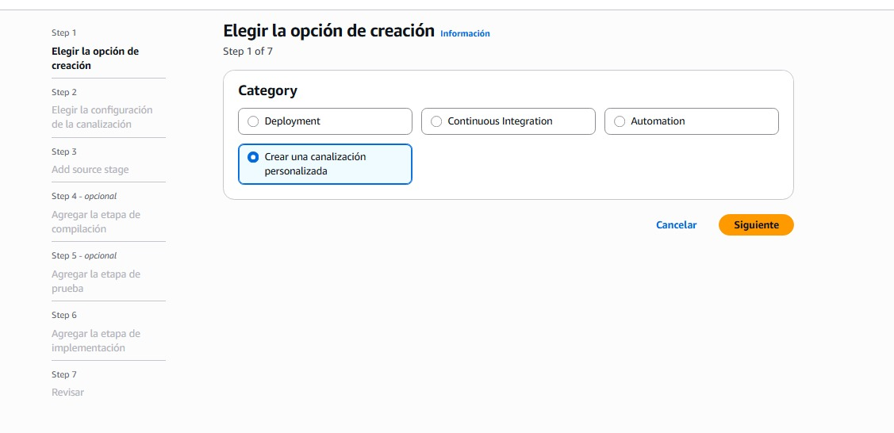

---

### Paso 2 – Configuración de la canalización

| Parámetro | Valor configurado |
|---|---|
| **Nombre** | `ebs-test` |
| **Tipo** | V2 |
| **Modo de ejecución** | En cola (*Queued*) |
| **Rol de servicio** | Nuevo rol de servicio |
| **Nombre del rol** | `AWSCodePipelineServiceRole-us-east-1-ebs-test` |

El modo *En cola* garantiza que si se disparan múltiples ejecuciones simultáneas, se ejecuten en orden secuencial.

**Figura 2:**

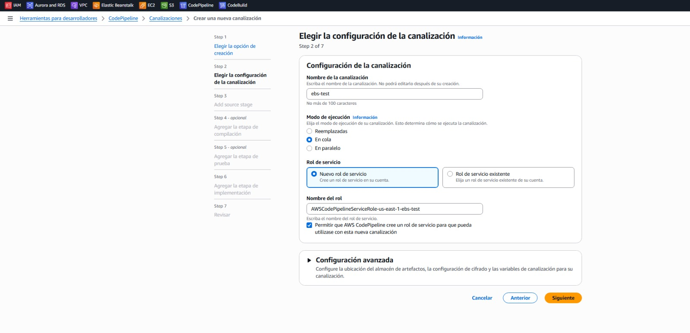

---

### Paso 3 – Etapa de origen (Source)

| Parámetro | Valor configurado |
|---|---|
| **Proveedor** | GitHub (a través de GitHub App) |
| **Repositorio** | `sfbarrera/4304-DEVOPS-Proyecto` |
| **Rama** | `main` |
| **Formato de artefacto** | CodePipeline predeterminado (`CODE_ZIP`) |
| **Detección de cambios** | Webhook habilitado (push y pull requests) |
| **Reintento automático** | Activado |

El webhook garantiza que el pipeline se dispare automáticamente ante cada `commit` o `push` a la rama `main`.

**Figura 3:**

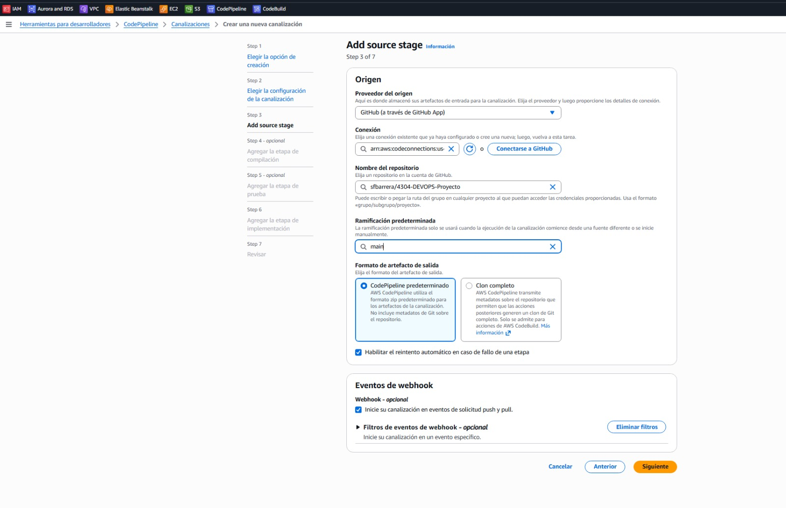

---

### Paso 4 – Etapa de compilación (Build) y creación del proyecto CodeBuild

Se seleccionó **AWS CodeBuild** como proveedor de compilación con tipo *Compilación única*.

**Figura 4:**

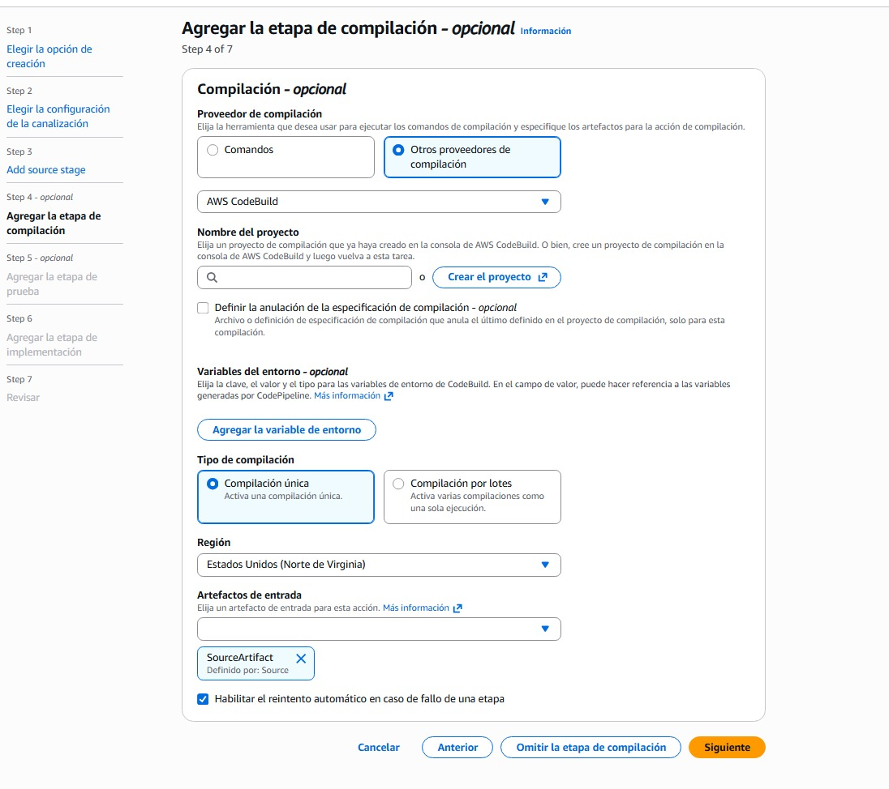

Desde el mismo asistente se creó el proyecto de CodeBuild con la siguiente configuración de entorno:

| Parámetro | Valor configurado |
|---|---|
| **Nombre del proyecto** | `ebs-test-test-test` |
| **Modelo de aprovisionamiento** | Bajo demanda |
| **Imagen del entorno** | Imagen administrada por AWS |
| **Computación** | EC2 |
| **Modo de ejecución** | Contenedor (Docker) |
| **Sistema operativo** | Amazon Linux |
| **Runtime** | Standard |
| **Imagen** | `aws/codebuild/amazonlinux-x86_64-standard:6.0` |
| **Versión de imagen** | Siempre la más reciente |
| **Rol de servicio** | Nuevo rol (`codebuild-ebs-test-test-test-test-service-role`) |

**Figura 5:**

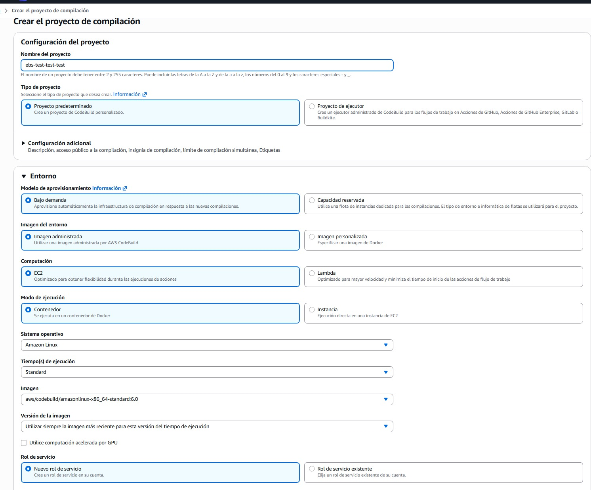

Para la especificación de compilación se configuró el rol de servicio y el envío de logs a **CloudWatch Logs** (`aws/codebuild/ebs-test-test-test`):

**Figura 6:**

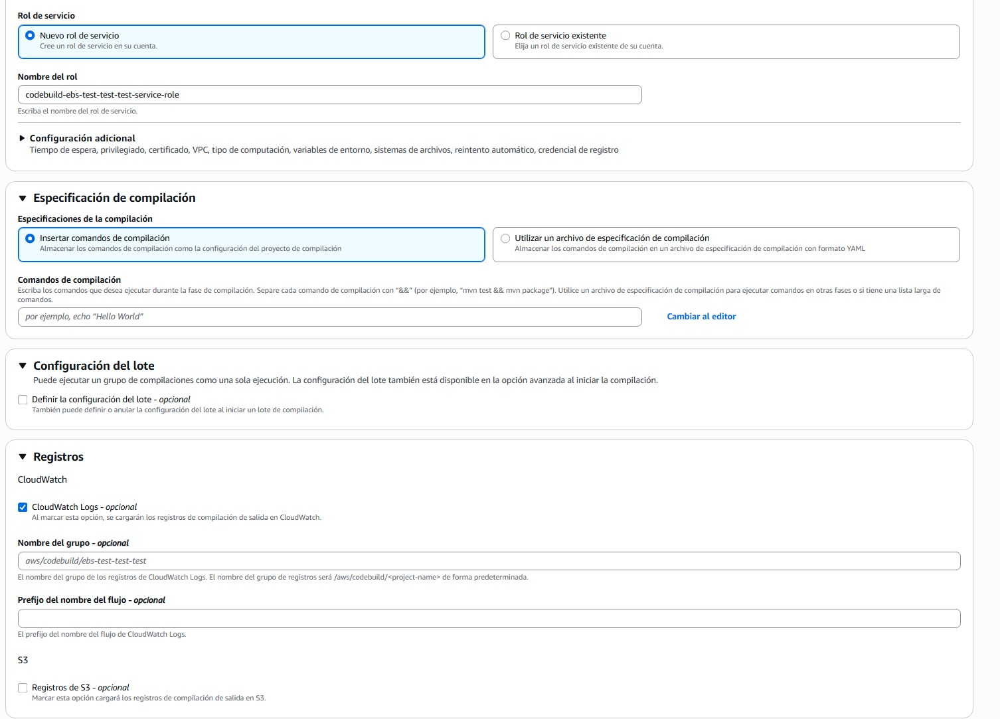

Para el proyecto de la etapa de **pruebas**, la especificación se definió de forma inline con los comandos de instalación y ejecución de pytest:

```yaml
version: 0.2

phases:
  install:
    runtime-versions:
      python: 3.11
    commands:
      - python -m pip install --upgrade pip
      - pip install -r requirements.txt
      - pip install -r requirements-dev.txt
  build:
    commands:
      - echo "==== Ejecutando pruebas unitarias ===="
      - pytest -v --maxfail=1 --disable-warnings
      - echo "==== Pruebas finalizadas ===="
```

**Figura 7:**

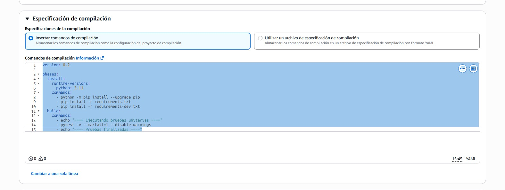

Para el proyecto de la etapa de **build**, la especificación fue configurada para utilizar el archivo **`buildspec.yml`** en la raíz del repositorio:

**Figura 8:**

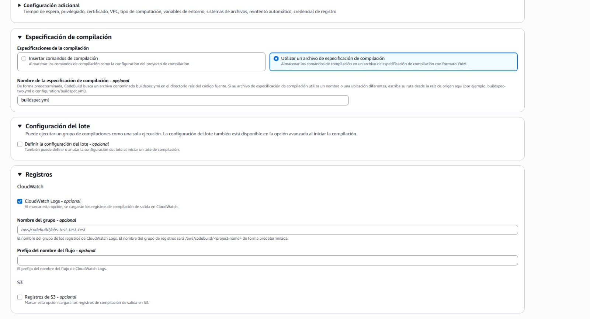

Una vez creado el proyecto, el asistente confirmó su vinculación exitosa con el pipeline:

**Figura 9:**

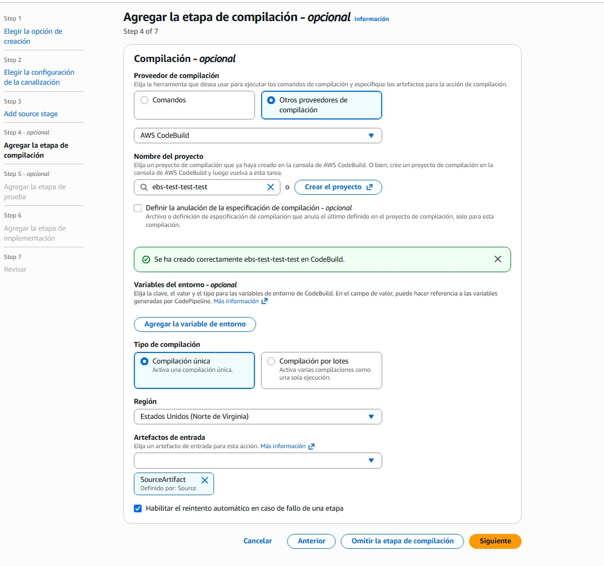

---

### Paso 5 – Etapa de prueba (Test)

Se agregó una etapa de prueba separada también sobre **AWS CodeBuild**, permitiendo distinguir en el pipeline entre la fase de construcción del artefacto y la fase de validación.

| Parámetro | Valor configurado |
|---|---|
| **Proveedor** | AWS CodeBuild |
| **Región** | Estados Unidos (Norte de Virginia) |
| **Proyecto** | `codebuild-test-test` |
| **Artefactos de entrada** | `SourceArtifact` (definido por Source) |
| **Reintento automático** | Activado |

**Figura 10:**

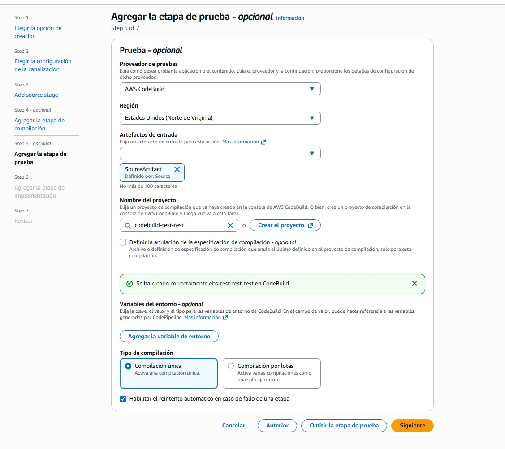

---

### Paso 7 – Revisión y creación

El asistente presentó el resumen final de configuración antes de crear la canalización:

| Sección | Detalle |
|---|---|
| **Nombre** | `ebs-test` |
| **Tipo** | V2 / Modo QUEUED |
| **Rol CodePipeline** | `AWSCodePipelineServiceRole-us-east-1-ebs-test` |
| **Source** | GitHub → `sfbarrera/4304-DEVOPS-Proyecto` → `main` |
| **DetectChanges** | `true` (trigger automático) |
| **Build** | AWS CodeBuild → proyecto `ebs-test-test-test` |

**Figura 11:**

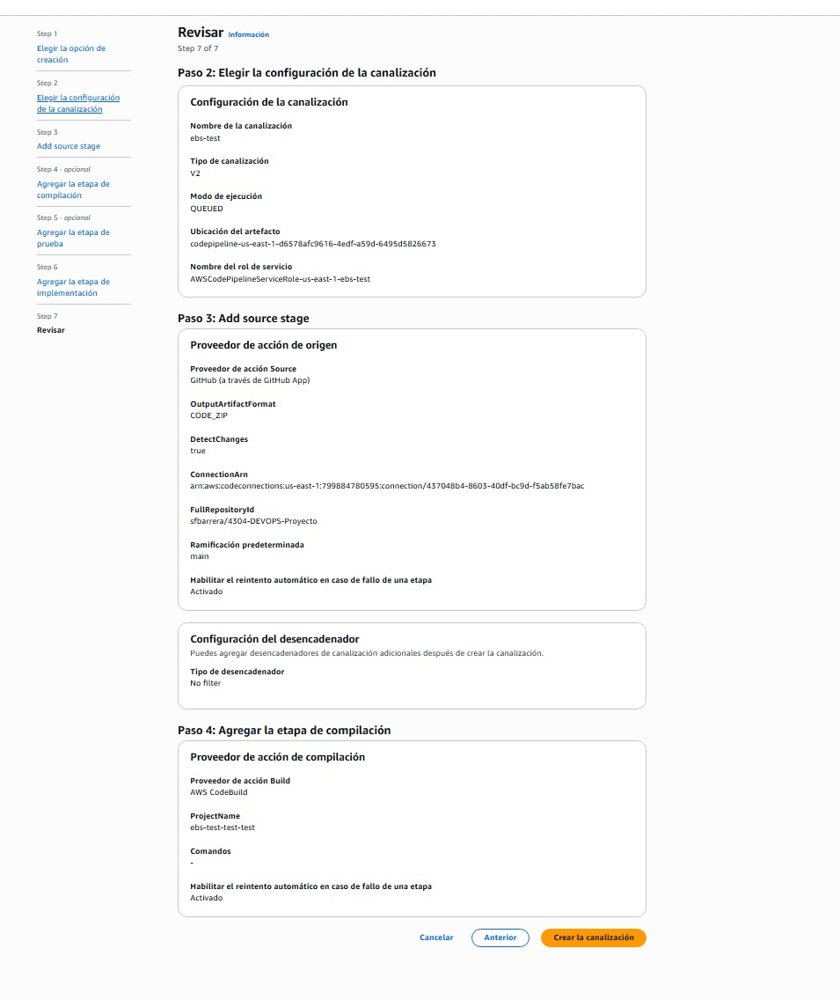

---

### Pipeline final en operación

Una vez creado y corregidos los errores de configuración (documentados en la Sección 5), el pipeline `ebs-test-app` ejecutó exitosamente las tres etapas encadenadas:

```
Source (GitHub) ✅  →  Build (AWS CodeBuild) ✅  →  Test (AWS CodeBuild) ✅
```

El disparador fue el commit `b06c7c88` con mensaje *"test: trigger CI pipeline 23"*, confirmando el funcionamiento del trigger automático por push a `main`.

**Figura 12:**

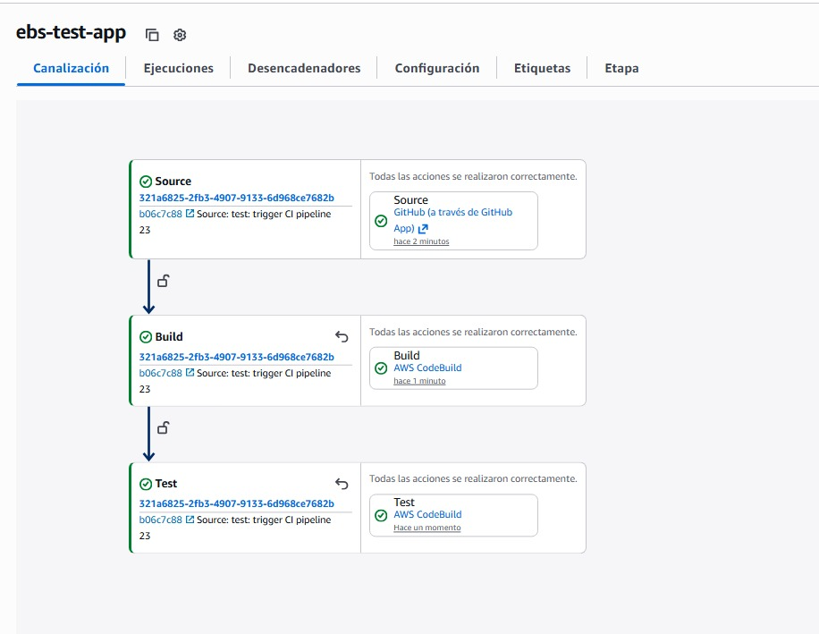

---

### Historial de ejecuciones

La consola de ejecuciones muestra el historial completo del pipeline, evidenciando el proceso iterativo de configuración hasta lograr una ejecución exitosa:

| ID de ejecución | Estado | Disparador | Hora (UTC-5) | Duración |
|---|---|---|---|---|
| `321a6825` | Exitoso | Commit `b06c7c88` – *test: trigger CI pipeline 23* | 26 Abr 7:45 PM | 17 s |
| `3e159926` | Error | Commit `69320df6` – *test: trigger CI pipeline* | 26 Abr 7:40 PM | 17 s |
| `465ed028` | Error | Commit `43c446fd` – *test: trigger CI pipeline* | 26 Abr 7:37 PM | 16 s |
| `7974aeb1` | Error | CreatePipeline – *pipeline is up 2* | 26 Abr 7:34 PM | 18 s |

**Figura 13:**

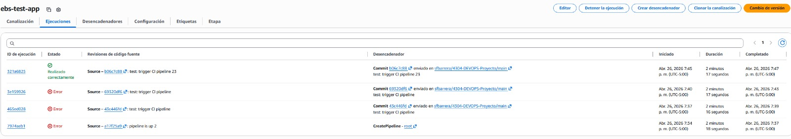

---

## 5. Ejecución Exitosa del Pipeline

### 5.1 Resumen de la ejecución

| Parámetro | Valor |
|---|---|
| **Pipeline** | `ebs-pipeline-final` |
| **Fecha de inicio** | 2026-04-26 02:08:49 UTC |
| **Fecha de finalización** | 2026-04-26 02:09:14 UTC |
| **Duración total** | ~25 segundos |
| **Estado final** | SUCCEEDED |
| **Artefacto generado** | `build/app.zip` |

### 5.2 Resultado por fase

| Fase | Estado | Detalle |
|---|---|---|
| `DOWNLOAD_SOURCE` | SUCCEEDED | Código descargado del repositorio |
| `INSTALL` | SUCCEEDED | Python 3.11.15, dependencias instaladas |
| `PRE_BUILD` | SUCCEEDED | **16 pruebas pasadas**, 22 advertencias |
| `BUILD` | SUCCEEDED | `app.zip` generado correctamente |
| `POST_BUILD` | SUCCEEDED | Confirmación de fecha |
| `UPLOAD_ARTIFACTS` | SUCCEEDED | Artefacto subido a S3 |

### 5.3 Hallazgos

**Instalación de dependencias:**
CodeBuild instaló todas las dependencias correctamente desde `requirements.txt` (Flask, SQLAlchemy, Flask-JWT-Extended, psycopg2, gunicorn, entre otras) y `requirements-dev.txt` (pytest 8.3.3).

**Ejecución de pruebas:**
```
................                                                         [100%]
16 passed, 22 warnings in 1.33s
```
Las 16 pruebas unitarias pasaron en 1.33 segundos. Las advertencias corresponden a versiones de dependencias pero no afectan la funcionalidad.

**Generación del artefacto:**
El artefacto `build/app.zip` fue generado empaquetando el código fuente de la aplicación, excluyendo archivos de desarrollo (tests, cache, entornos virtuales). El artefacto fue subido exitosamente a Amazon S3.

**Mensaje de finalización:**
```
Build successfully completed on Sun Apr 26 02:09:14 AM UTC 2026
```

### 5.4 Evidencia

**Figura 14:** Vista de la consola de AWS CodeBuild mostrando el log completo del build exitoso.

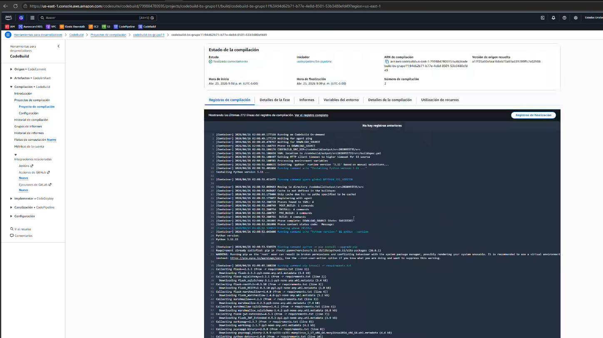

---

### 5.5 Detalle de la etapa de Build (`codebuild-test-build`)

Esta etapa ejecuta el proyecto `codebuild-test-build`, responsable de instalar las dependencias de producción y generar el artefacto `app.zip`.

| Parámetro | Valor |
|---|---|
| **ID de compilación** | `aa625ee2-aae7-4ee9-9f23-a3e65fe0d90a` |
| **Número de compilación** | 4 |
| **Iniciador** | `codepipeline/ebs-test-app` |
| **Hora de inicio** | 26 Abr 2026 7:45 PM (UTC-5) |
| **Hora de finalización** | 26 Abr 2026 7:46 PM (UTC-5) |
| **Estado** | Realizado correctamente |

El log muestra la fase `INSTALL` instalando Python 3.11 y todas las dependencias de `requirements.txt` (Flask, SQLAlchemy, Flask-JWT-Extended, psycopg2-binary, gunicorn, entre otras) y `requirements-dev.txt`.

**Figura 15:**

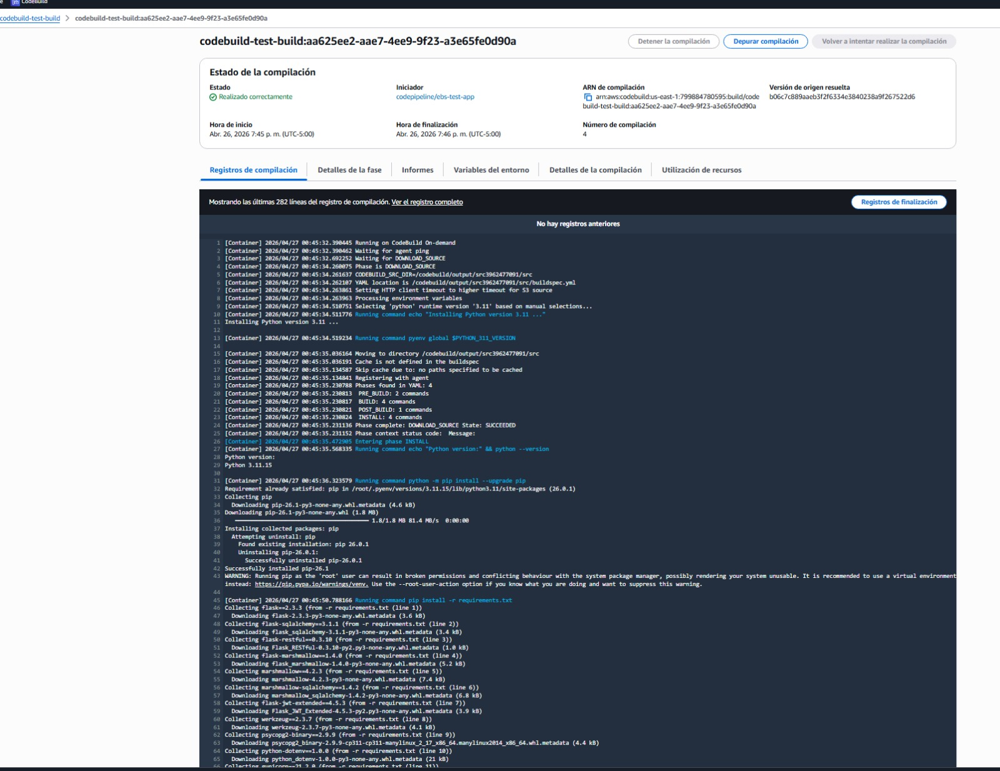

La fase `BUILD` empaqueta el código fuente en `build/app.zip` excluyendo archivos de desarrollo, seguida de `POST_BUILD` y `UPLOAD_ARTIFACTS`, todas en estado `SUCCEEDED`.

**Figura 16:**

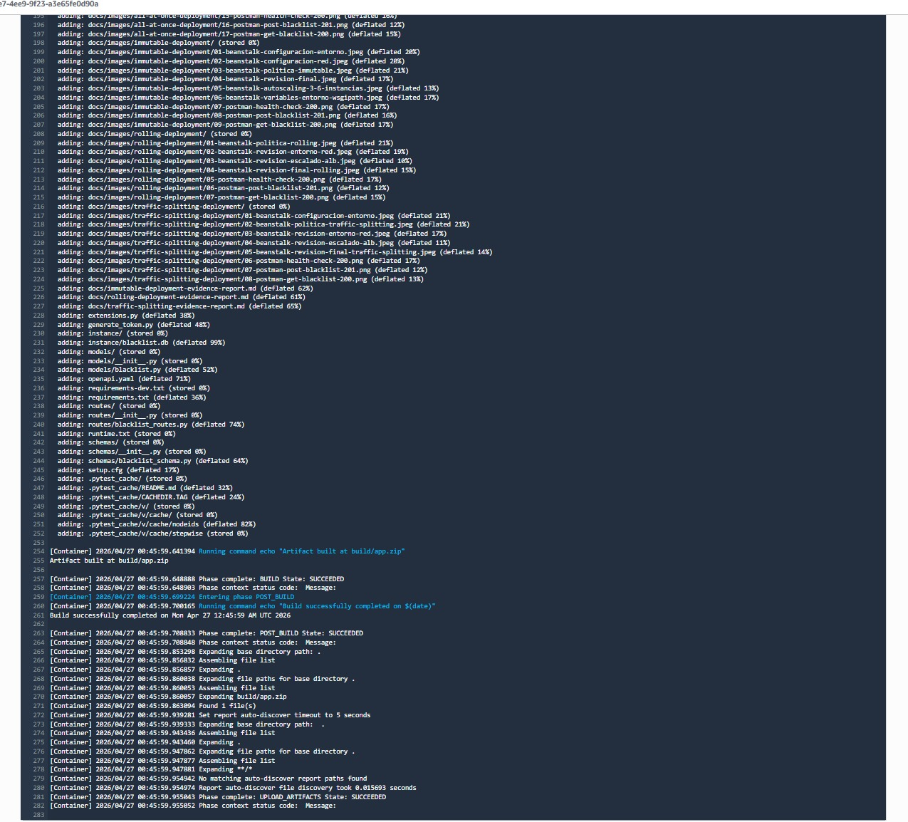

---

### 5.6 Detalle de la etapa de Test (`codebuild-test-test`)

Esta etapa ejecuta el proyecto `codebuild-test-test`, responsable de correr las pruebas unitarias con pytest sobre el código fuente.

| Parámetro | Valor |
|---|---|
| **ID de compilación** | `7db98456-35d0-4192-8d30-b22040250759` |
| **Número de compilación** | 7 |
| **Iniciador** | `codepipeline/ebs-test-app` |
| **Hora de inicio** | 26 Abr 2026 7:46 PM (UTC-5) |
| **Hora de finalización** | 26 Abr 2026 7:47 PM (UTC-5) |
| **Estado** | Realizado correctamente |

El log muestra la fase `INSTALL` instalando Python 3.11 junto con todas las dependencias de producción y de desarrollo (`pytest 8.3.3`).

**Figura 17:**

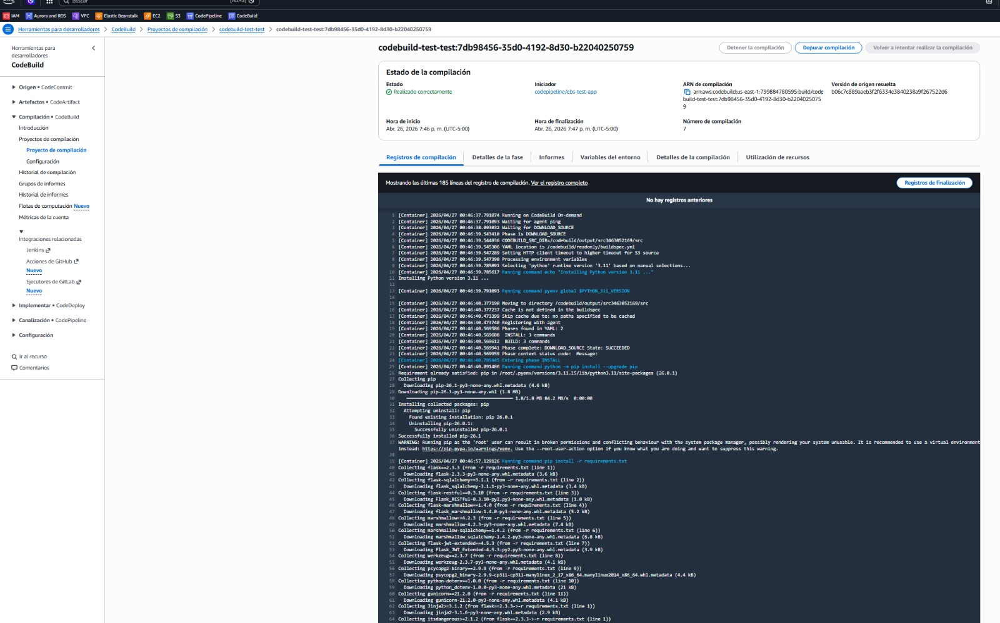

La fase `BUILD` ejecuta pytest con los 16 casos de prueba, todos con resultado `PASSED`:

```
platform linux -- Python 3.11.15, pytest-8.3.3, pluggy-1.6.0
rootdir: /codebuild/output/src346385025169/src
collected 16 items

tests/test_blacklist.py::test_post_blacklist_success PASSED              [  6%]
tests/test_blacklist.py::test_post_blacklist_without_reason PASSED       [ 12%]
tests/test_blacklist.py::test_post_blacklist_duplicate PASSED            [ 18%]
tests/test_blacklist.py::test_post_blacklist_invalid_uuid PASSED         [ 25%]
tests/test_blacklist.py::test_post_blacklist_invalid_email PASSED        [ 31%]
tests/test_blacklist.py::test_post_blacklist_reason_too_long PASSED      [ 37%]
tests/test_blacklist.py::test_post_blacklist_missing_email PASSED        [ 43%]
tests/test_blacklist.py::test_post_blacklist_missing_app_uuid PASSED     [ 50%]
tests/test_blacklist.py::test_post_blacklist_empty_body PASSED           [ 56%]
tests/test_blacklist.py::test_post_blacklist_no_token PASSED             [ 68%]
tests/test_blacklist.py::test_post_blacklist_invalid_token PASSED        [ 75%]
tests/test_blacklist.py::test_get_blacklisted_email PASSED               [ 81%]
tests/test_blacklist.py::test_get_non_blacklisted_email PASSED           [ 87%]
tests/test_blacklist.py::test_get_blacklist_no_token PASSED              [ 93%]
tests/test_blacklist.py::test_health_check_ok PASSED                     [ 93%]
tests/test_blacklist.py::test_health_check_no_auth_required PASSED       [100%]

==================== 16 passed, 22 warnings in 1.25s ====================
```

**Figura 18:**

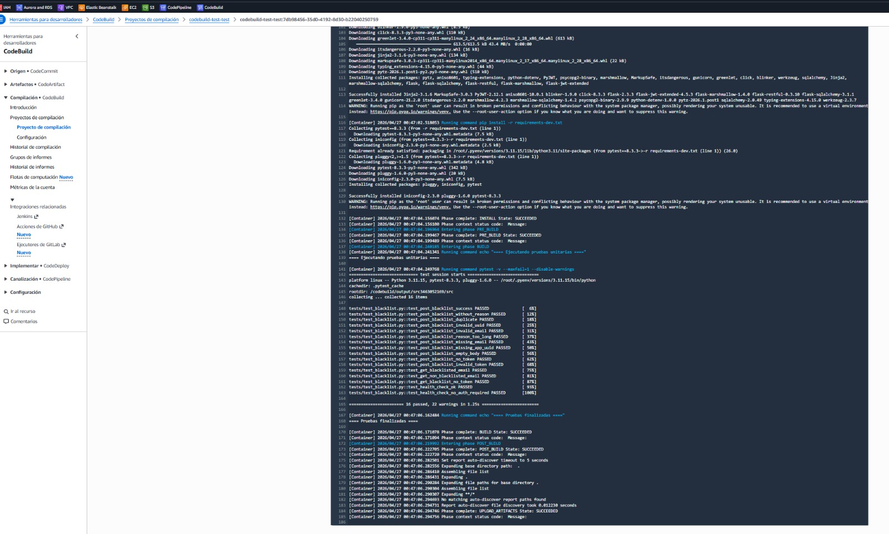

---

### 5.7 Artefactos construidos en Amazon S3

Cada ejecución del pipeline almacena sus artefactos en un bucket de **Amazon S3** bajo dos carpetas diferenciadas: `BuildArtif/` para los artefactos generados por la etapa de compilación, y `SourceArti/` para los artefactos de código fuente capturados por la etapa de origen.

#### Carpeta `BuildArtif/` — artefactos de compilación

Contiene los artefactos generados por AWS CodeBuild. Cada objeto corresponde a una ejecución del pipeline y pesa aproximadamente **4.0 MB**.

| Objeto | Última modificación | Tamaño |
|---|---|---|
| `tCSPEBH` | 26 Abr 2026 7:46 PM | 4.0 MB |
| `1OOr3Jy` | 26 Abr 2026 7:41 PM | 4.0 MB |
| `cuY2xLj` | 26 Abr 2026 7:38 PM | 4.0 MB |
| `byOuTAK` | 26 Abr 2026 7:35 PM | 4.0 MB |

**Figura 19:**

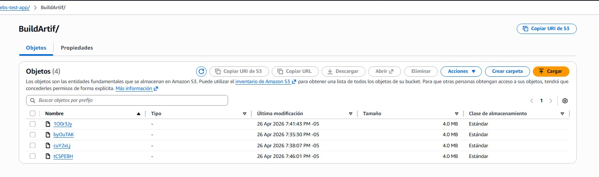

#### Carpeta `SourceArti/` — artefactos de código fuente

Contiene los artefactos de origen capturados por la etapa Source del pipeline (código empaquetado desde GitHub).

| Objeto | Última modificación | Tamaño |
|---|---|---|
| `ZdtBg1z` | 26 Abr 2026 7:45 PM | 4.0 MB |
| `jMv6xZ9` | 26 Abr 2026 7:41 PM | 4.0 MB |
| `DLG6uYk` | 26 Abr 2026 7:37 PM | 4.0 MB |
| `SvSK6gW` | 26 Abr 2026 7:34 PM | 4.0 MB |

**Figura 20:**

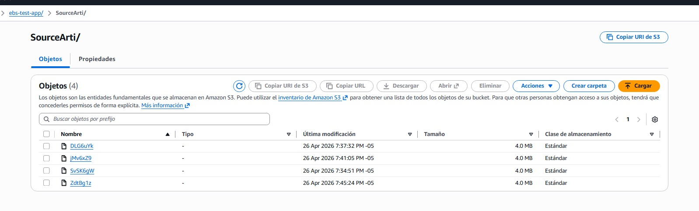

#### Contenido del artefacto (`app.zip`)

Al descargar y extraer uno de los artefactos de `BuildArtif/`, se obtiene el `app.zip` con la estructura completa del microservicio lista para despliegue en Elastic Beanstalk:

| Carpeta / Archivo | Descripción |
|---|---|
| `.ebextensions/` | Configuración de Elastic Beanstalk |
| `models/` | Modelos de base de datos |
| `routes/` | Definición de endpoints |
| `schemas/` | Esquemas de validación |
| `app.py` | Punto de entrada de la aplicación Flask |
| `application.py` | Entrypoint para Elastic Beanstalk |
| `buildspec.yml` | Especificación de build para CodeBuild |
| `Procfile` | Comando de inicio para gunicorn |
| `requirements.txt` | Dependencias de producción |
| `openapi.yaml` | Especificación de la API |

**Figura 21:**

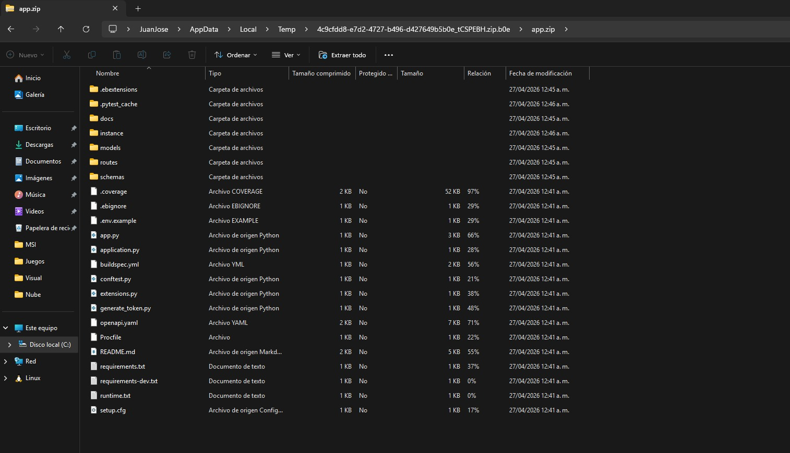

#### Descarga del artefacto desde S3

El artefacto puede ser descargado directamente desde la consola de S3. El archivo `ZdtBg1z` corresponde al artefacto de la ejecución exitosa más reciente, con un tamaño de **4,095 KB**.

**Figura 22:**

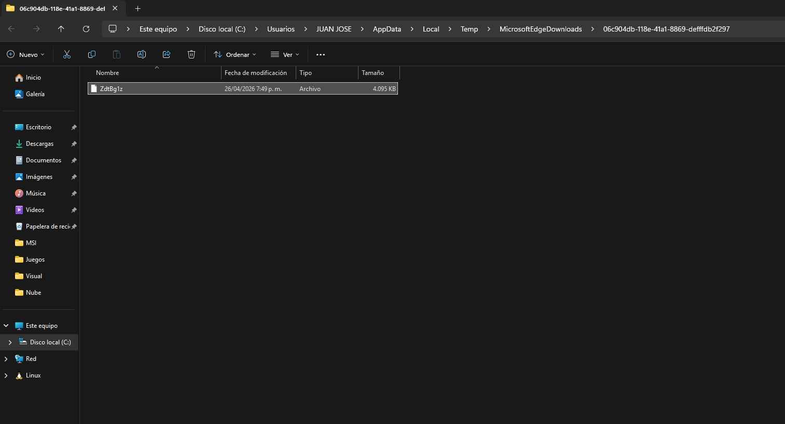

---

## 6. Ejecuciones Fallidas del Pipeline

Durante el proceso de configuración del pipeline se registraron dos ejecuciones fallidas, cada una con una causa raíz distinta. Ambas se documentan a continuación.

---

### 6.1 Fallo por error de permisos IAM (AssumeRole)

#### Resumen de la ejecución

| Parámetro | Valor |
|---|---|
| **Pipeline** | `ebs-pipe-test` |
| **ID de ejecución** | `910e2eff-392b-462a-ad92-1afc2b1d375d` |
| **Disparador** | `CreatePipeline – root` |
| **Duración** | 8 segundos |
| **Estado final** | ERROR |
| **Fase con fallo** | `BUILD` (inicio del build) |

#### Descripción del error

```
Error calling startBuild: CodeBuild is not authorized to perform: sts:AssumeRole
on service role. Please verify that:
  1) The provided service role exists,
  2) The role name is case-sensitive and matches exactly, and
  3) The role has the necessary trust policy configured.
(Service: AWSCodeBuild; Status Code: 400; Error Code: InvalidInputException;
 Request ID: 31ca4553-c45e-4fcd-8642-97c45d188e09)
```

#### Análisis de la causa raíz

El pipeline intentó iniciar un build en AWS CodeBuild, pero falló al momento de asumir el rol IAM de servicio (*service role*) asignado al proyecto.

**Causa:** El rol IAM configurado en el proyecto de CodeBuild no tenía la *trust policy* correcta para permitir que el servicio `codebuild.amazonaws.com` lo asumiera mediante `sts:AssumeRole`. Esto ocurrió porque el pipeline fue creado con un rol IAM recién generado, cuya relación de confianza con CodeBuild no había sido configurada correctamente.

**Flujo del fallo:**

```
Source (GitHub) → SUCCEEDED  ✅
        │
        ▼
Build (AWS CodeBuild)
  └── startBuild → FAILED ❌  (duración total: 8 s)
        Razón: sts:AssumeRole denegado sobre el service role de CodeBuild
        El rol IAM no tenía trust policy para codebuild.amazonaws.com
```

#### Hallazgos

- La etapa **Source** completó exitosamente: el código fue descargado desde GitHub sin problemas.
- El fallo ocurrió antes de que CodeBuild pudiera inicializar el contenedor de build. La duración de solo 8 segundos confirma que el error es previo a cualquier ejecución de comandos.
- La corrección requirió verificar que el rol IAM del proyecto de CodeBuild incluyera en su *trust policy* la siguiente entrada:
  ```json
  {
    "Effect": "Allow",
    "Principal": { "Service": "codebuild.amazonaws.com" },
    "Action": "sts:AssumeRole"
  }
  ```

#### Evidencia

**Figura 23:** Vista de la consola de AWS CodePipeline mostrando la ejecución fallida `910e2eff` en el pipeline `ebs-pipe-test`, con el error `InvalidInputException` por falta de permisos IAM en la etapa de Build.

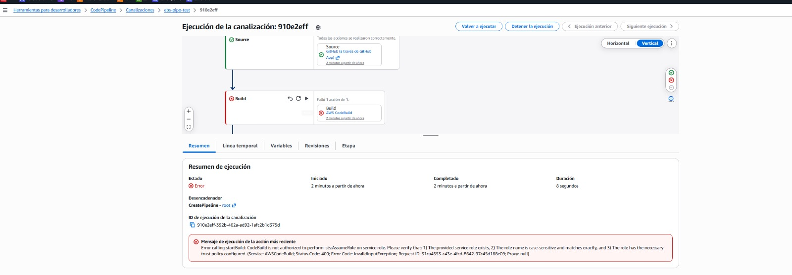

---

### 6.2 Fallo por archivo de configuración no encontrado (YAML_FILE_ERROR)

#### Resumen de la ejecución

| Parámetro | Valor |
|---|---|
| **Pipeline** | `ebs-pipeline-final` |
| **ID de ejecución** | `532cdcbf-9ff4-4a11-8065-db921742e0cc` |
| **Disparador** | `CreatePipeline – root` |
| **Duración** | 1 minuto 9 segundos |
| **Estado final** | ERROR |
| **Fase con fallo** | `DOWNLOAD_SOURCE` |

#### Descripción del error

```
Build terminated with state: FAILED.
Phase: DOWNLOAD_SOURCE
Code: YAML_FILE_ERROR
Message: stat /codebuild/output/src816743214/src/buildspec.yml: no such file or directory
```

#### Análisis de la causa raíz

El fallo ocurrió durante la fase `DOWNLOAD_SOURCE`, antes de que el build comenzara. AWS CodeBuild intentó leer el archivo `buildspec.yml` en la raíz del repositorio descargado, pero no lo encontró.

**Causa:** El pipeline `ebs-pipeline-final` fue creado y ejecutado antes de que el archivo `buildspec.yml` fuera confirmado (*committed*) en la rama `main` del repositorio. Como resultado, CodeBuild descargó el código fuente pero no pudo localizar el archivo de instrucciones de build.

**Flujo del fallo:**

```
Source (GitHub) → SUCCEEDED  ✅
        │
        ▼
Build (AWS CodeBuild)
  └── DOWNLOAD_SOURCE → FAILED ❌
        Razón: buildspec.yml no encontrado en el directorio fuente
        (el archivo aún no existía en la rama main del repositorio)
```

#### Hallazgos

- La etapa **Source** completó exitosamente: el código fue descargado desde GitHub sin problemas.
- El fallo ocurrió en la subfase de lectura del archivo de configuración (`YAML_FILE_ERROR`). CodeBuild no puede continuar sin `buildspec.yml`, ya que este define todas las instrucciones del build.
- El fallo fue resuelto agregando el archivo `buildspec.yml` a la raíz del repositorio y realizando un nuevo commit a `main`, lo que disparó automáticamente una ejecución exitosa posterior.

#### Evidencia

**Figura 24:** Vista de la consola de AWS CodePipeline mostrando la ejecución fallida `532cdcbf` en el pipeline `ebs-pipeline-final`, con el mensaje de error `YAML_FILE_ERROR` en la etapa de Build.

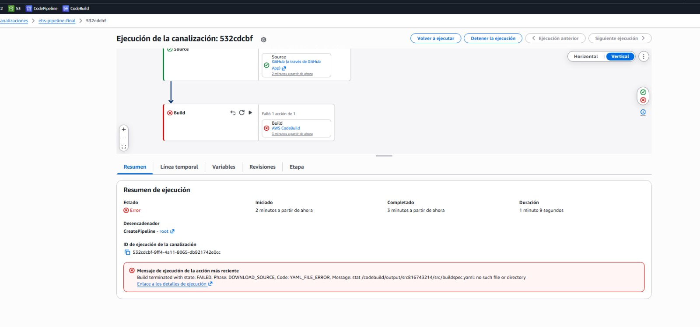

---

## 7. Conclusiones

| Aspecto | Resultado |
|---|---|
| Configuración del pipeline (CodePipeline + CodeBuild) | Implementada correctamente |
| Trigger automático en commits a `main` | Funcional |
| Ejecución de pruebas unitarias en CI | 16/16 pruebas pasadas |
| Generación del artefacto en CI | `app.zip` generado y subido a S3 |
| Documentación de ejecución exitosa | Registrada con log y captura de pantalla |
| Documentación de ejecución fallida (IAM AssumeRole) | Registrada con análisis de causa raíz y captura de pantalla |
| Documentación de ejecución fallida (YAML_FILE_ERROR) | Registrada con análisis de causa raíz y captura de pantalla |

Las dos ejecuciones fallidas documentadas ilustran errores reales de configuración encontrados durante el proceso de implementación, junto con su análisis y resolución.
